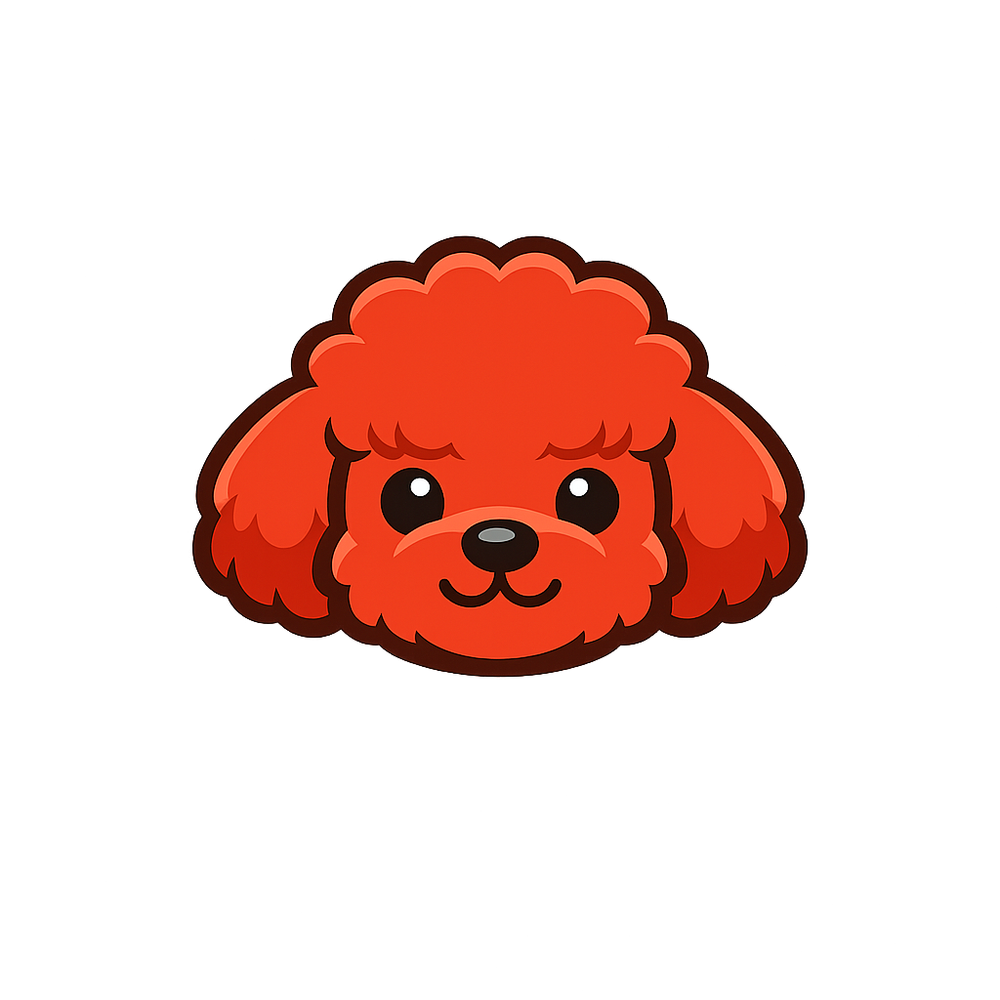

<div align="center">



# OpenTeddy

**A self-growing multi-agent system built on Gemma + Qwen + Claude**

<p>
  
  
  
  
  
</p>

OpenTeddy orchestrates a trio of AI agents to autonomously plan, execute,
and improve over time — automatically generating Python "skills" to handle
recurring tasks faster on future runs.

</div>

---

## Highlights

- **Local-first** — planning (Gemma) and execution (Qwen) run on your machine via Ollama; Claude is only called when local models struggle.
- **Auto-escalation to Claude** — timeouts, low confidence, repeated failures, hard-failure signals in tool output (e.g. `unhealthy` containers, `ERROR 1045`), or failed health checks all trigger Claude intervention automatically.
- **Self-growing skills** — repeated tasks are promoted into reusable Python skills, cutting LLM calls over time.
- **Web dashboard** — submit tasks, watch tool calls stream live, review pending approvals, manage memory, and tune settings.
- **Human-in-the-loop** — high-risk shell commands (rm, sudo, mv, …) pause for approval before running.
- **Persistent memory** — ChromaDB-backed long-term memory feeds relevant context back into future plans.
- **Hot-reloadable settings** — change models, thresholds, and endpoints without restarting the server.

## Architecture

```
User Goal
   │
   ▼
┌───────────────────────────────────────────────────┐
│  Orchestrator  (Gemma via Ollama)                  │
│  • Decomposes goal into ordered SubTasks           │
│  • Retrieves long-term memory for context          │
│  • Drives execution + escalation loop              │
└────────────────────┬──────────────────────────────┘
                     │ SubTasks
                     ▼
┌───────────────────────────────────────────────────┐
│  Executor  (Qwen via Ollama, function calling)     │
│  • Runs a matching Skill if available              │
│  • Uses tools: shell, file, http, db, gcp, package │
│  • Falls back to LLM inference                     │
│  • Reports confidence (clamped on hard failures)   │
└────────────────────┬──────────────────────────────┘
    low conf │ timeout │ failure signal │ unhealthy
                     ▼
┌───────────────────────────────────────────────────┐
│  Escalation Agent  (Claude via API)                │
│  • Resolves hard subtasks with full diagnostics    │
│  • Synthesises the final summary                   │
└────────────────────┬──────────────────────────────┘
                     ▼
┌───────────────────────────────────────────────────┐
│  Skill Factory  (Claude via API)                   │
│  • Generates new Python skills on demand           │
│  • Promotes skills after N successes               │
│  • Saves skills to disk + SQLite DB                │
└───────────────────────────────────────────────────┘
```

## File Structure

```
OpenTeddy/
├── config.py          # Config via .env / environment variables
├── models.py          # Pydantic models + SQLite schema
├── tracker.py         # Async SQLite persistence (aiosqlite)
├── skill_factory.py   # Claude-powered skill generation & loader
├── executor.py        # Qwen executor agent (function calling + failure clamp)
├── escalation.py      # Claude escalation agent
├── orchestrator.py    # Gemma orchestrator (plan → verify → escalate)
├── memory.py          # ChromaDB long-term memory
├── approval_store.py  # Human-in-the-loop approval queue
├── settings_store.py  # Hot-reloadable settings (SQLite-backed)
├── tool_registry.py   # Tool registration + risk gating
├── tools/             # shell / file / http / db / gcp / package
├── skills/            # Auto-generated skill .py files
├── static/            # Web dashboard (index.html + teddy.png)
├── main.py            # FastAPI server + CLI entry point
└── .env.example       # Environment variable template
```

## Quick Start

### 1. Prerequisites

- Python 3.11+
- [Ollama](https://ollama.ai) running locally:
  ```bash
  ollama pull gemma3:4b
  ollama pull qwen2.5:3b
  ```
- An Anthropic API key (used for escalation and skill generation)

### 2. Install

```bash
git clone https://github.com/m31527/OpenTeddy.git
cd OpenTeddy
python -m venv .venv
source .venv/bin/activate   # Windows: .venv\Scripts\activate
pip install -r requirements.txt
```

### 3. Configure

```bash
cp .env.example .env
# Edit .env — at minimum set ANTHROPIC_API_KEY
```

### 4. Run

```bash
uvicorn main:app --reload
# Dashboard → http://localhost:8000
# API docs  → http://localhost:8000/docs
```

## API

| Method | Endpoint | Description |
|--------|----------|-------------|
| `POST` | `/run` | Submit a task |
| `GET`  | `/tasks/{id}` | Check task status |
| `GET`  | `/tasks` | List recent tasks |
| `GET`  | `/skills` | List all skills |
| `POST` | `/skills/generate?name=…&description=…` | Manually create a skill |
| `GET`  | `/tools` | List available tools |
| `GET`  | `/approvals` | Pending human approvals |
| `POST` | `/approvals/{id}/approve` \| `/reject` | Resolve an approval |
| `GET`  | `/memory` | Browse long-term memory |
| `GET`  | `/usage`, `/usage/summary` | Token usage & cost |
| `GET`  | `/settings` \| `POST` `/settings` | Read/update runtime settings |
| `GET`  | `/settings/ollama/models` \| `/status` | Local model management |
| `GET`  | `/health` | Health check |
| `WS`   | `/ws` | Live event stream (tool calls, results) |

### Example request

```bash
curl -X POST http://localhost:8000/run \
  -H 'Content-Type: application/json' \
  -d '{"goal": "Summarise the key benefits of async Python", "priority": 7}'
```

## How Claude Steps In

OpenTeddy tries to keep every task local. Claude is called **only** when the local path breaks down:

| Trigger | Where | Default |
|---------|-------|---------|
| Subtask timeout (local model hangs) | `orchestrator._run_subtask` | 120 s |
| Low self-reported confidence | `executor._qwen_execute` | `< 0.6` |
| Repeated failures in a row | `orchestrator._run_subtask` | 3 |
| Hard-failure signal in tool output (`unhealthy`, `Exited`, `ERROR 1045`, `Error response from daemon`, …) | `executor._finalize_response` | confidence clamped to 0.3 → escalates |
| Container health check fails after a Docker task | `orchestrator._inspect_docker_health` | auto-pulls `docker logs` + `inspect`, then escalates |

This keeps cost low for everyday work while still guaranteeing you get a real answer when the local model cannot deliver one.

## Self-Growth Mechanism

1. When Qwen executes a subtask it suggests a **skill name** if a reusable function would have helped.
2. The Executor calls `SkillFactory.generate_skill()` in the background.
3. Claude writes the skill as an `async def run(input_data: dict) -> str` function and saves it to `skills/<name>.py`.
4. The skill starts in **TESTING** status. After `SKILL_PROMOTION_THRESHOLD` successful invocations it is promoted to **ACTIVE**.
5. Future tasks automatically match and invoke active skills — no LLM call needed.

## Configuration Reference

| Variable | Default | Description |
|----------|---------|-------------|
| `ANTHROPIC_API_KEY` | — | **Required.** Anthropic API key |
| `CLAUDE_MODEL` | `claude-opus-4-6` | Claude model for escalation |
| `GEMMA_BASE_URL` | `http://localhost:11434` | Ollama base URL for Gemma |
| `GEMMA_MODEL` | `gemma3:4b` | Gemma model tag |
| `QWEN_BASE_URL` | `http://localhost:11434` | Ollama base URL for Qwen |
| `QWEN_MODEL` | `qwen2.5:3b` | Qwen model tag |
| `DB_PATH` | `openteddy.db` | SQLite database path |
| `MEMORY_DB_PATH` | `./memory_db` | ChromaDB directory |
| `SKILLS_DIR` | `skills` | Directory for skill files |
| `ESCALATION_THRESHOLD` | `0.6` | Min Qwen confidence before escalation |
| `ESCALATION_FAILURE_LIMIT` | `3` | Max consecutive failures before abort |
| `SUBTASK_TIMEOUT` | `120` | Seconds before a subtask is treated as hung |
| `SKILL_PROMOTION_THRESHOLD` | `5` | Successes needed to promote a skill |

## Docker Deployment

```bash
cp .env.example .env
# Fill in ANTHROPIC_API_KEY
docker compose up -d
# Open http://localhost:8000
```

Notes:

- Ollama must be running on the host (`ollama serve`).
- The container reaches host Ollama via the `host-gateway` alias set in `docker-compose.yml`.
- Skills and the usage database persist in the `openteddy_data` Docker volume.
- Rebuild image: `docker compose up -d --build`.

## License

MIT
